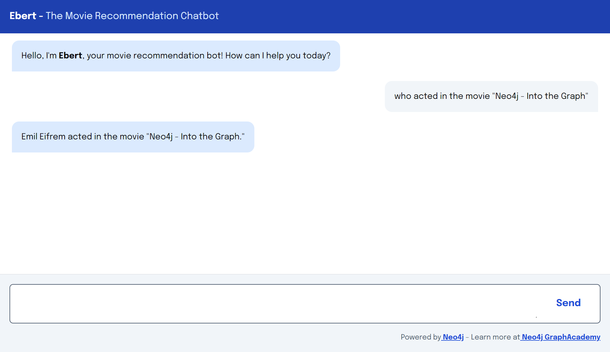

# Build a Neo4j-backed Chatbot using TypeScript



> [!NOTE]
> I have used [Mistral AI](https://mistral.ai/) (instead of OpenAI) which provides free trail for 15 days.
> During migration from OpenAI to MistralAI, I encountered some issues which I have documented below along with there possible fixes.

This repository accompanies the [Build a Neo4j-backed Chatbot using TypeScript](https://graphacademy.neo4j.com/courses/llm-chatbot-typescript/?ref=github) course on [Neo4j GraphAcademy](https://graphacademy.neo4j.com/?ref=github).

It was originally a [Next.js](https://nextjs.org/) project bootstrapped with [`create-next-app`](https://github.com/vercel/next.js/tree/canary/packages/create-next-app). We added:

* [TailwindCSS](https://tailwindcss.com/docs/guides/nextjs)
* [A `/api/chat` API route for handling chat requests](src/pages/api/)
* [A React hook for calling the `/api/chat` endpoint](src/hooks)
* [Some chat components to display the messages](src/components)

For a complete walkthrough of this repository, [enroll now](https://graphacademy.neo4j.com/courses/llm-chatbot-typescript/?ref=github).

## Setup your Config

To set up the config, create a `.env.local` file with connection details for your Neo4j Sandbox instance and an OpenAI API Key.
You can also configure the name and description of the chatbot, and the initial greeting message.

```env
NEO4J_URI="bolt://123.45.678.90:7687"
NEO4J_USERNAME="neo4j"
NEO4J_PASSWORD="three-word-password"

OPENAI_API_KEY=sk-...

NEXT_PUBLIC_CHATBOT_NAME=Ebert
NEXT_PUBLIC_CHATBOT_DESCRIPTION="The Movie Recommendation Chatbot"
NEXT_PUBLIC_CHATBOT_GREETING="Hello, I'm **Ebert**, your movie recommendation bot! How can I help you today?"
```

## Running the application

To run the application, you must install the dependencies listed in `package.json`.

```sh
npm i
```

Then run the `npm run dev` command to start the app on [http://localhost:3000/](http://localhost:3000/).

```sh
npm run dev
```

## Questions, Comments, Feedback

If you have any questions, experience any problems, or have any general feedback, feel free to open an Issue or you can reach out to us on [Discord](https://dev.neo4j.com/chat) or [Discourse](https://dev.neo4j.com/form).

---

## Issues and Possible Fixes

- `TypeError: A dynamic import callback was invoked without --experimental-vm-modules`
    > Change `test` command to `"test": "cross-env DOTENV_CONFIG_PATH=./.env.local NODE_OPTIONS=\"$NODE_OPTIONS --experimental-vm-modules\" jest"` in `package.json`.   
    > Refer [ECMAScript Modules in Jest](https://jestjs.io/docs/ecmascript-modules) for more.

- `Retrying request on response status: 429 Response: {"message":"Requests rate limit exceeded"}`
    > Don't run multiple tests at once. Mistral AI's free trial API allows `1` request per second.  
    > Or, add `await new Promise((r) => setTimeout(r, 1000));` after each call to Mistral AI's API (e.g. `someChain.invoke(...)`) to add delay of 1 second.

- `The provided embedding function and vector index dimensions do not match.`
    > OpenAI embeddings has 1536 dimensions and Mistral AI embeddings has 1024 dimensions.
    > Change `dimensions` from `1536` to `1024`.
    > ```cypher
    > CREATE VECTOR INDEX `moviePlots` IF NOT EXISTS
    > FOR (n: Movie) ON (n.embedding)
    > OPTIONS {indexConfig: {
    > `vector.dimensions`: 1024,
    > `vector.similarity_function`: 'cosine'
    > }};
    > ```
    > 
    > Now, use following cypher to load Mistral AI embeddings instead of OpenAI embedding.  
    > ```cypher
    > LOAD CSV WITH HEADERS
    > FROM 'https://raw.githubusercontent.com/nobleknightt/mistralai-embeddings/main/data/mistralai-embeddings.csv'
    > AS row
    > MATCH (m:Movie {movieId: row.movieId})
    > CALL db.create.setNodeVectorProperty(m, 'embedding', apoc.convert.fromJsonList(row.embedding))
    > RETURN count(*);
    > ```
    >
    > Refer [github.com/nobleknightt/mistralai-embeddings](https://github.com/nobleknightt/mistralai-embeddings/) for more.

- Test fails for **Challenge: Creating the Agent**
    > Use [Tool Calling Agent](https://js.langchain.com/v0.1/docs/modules/agents/agent_types/tool_calling/) instead of OpenAI Functions Agent.
